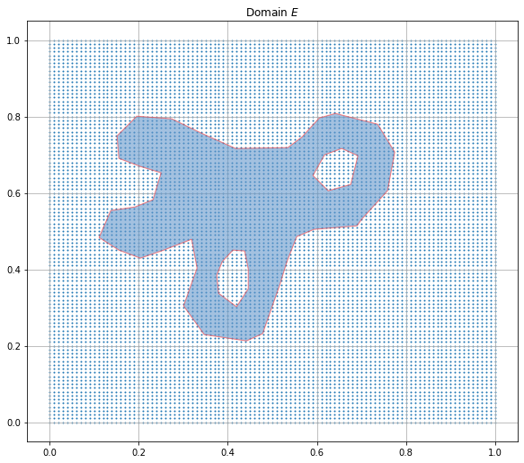
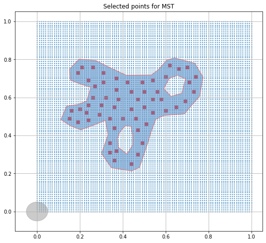
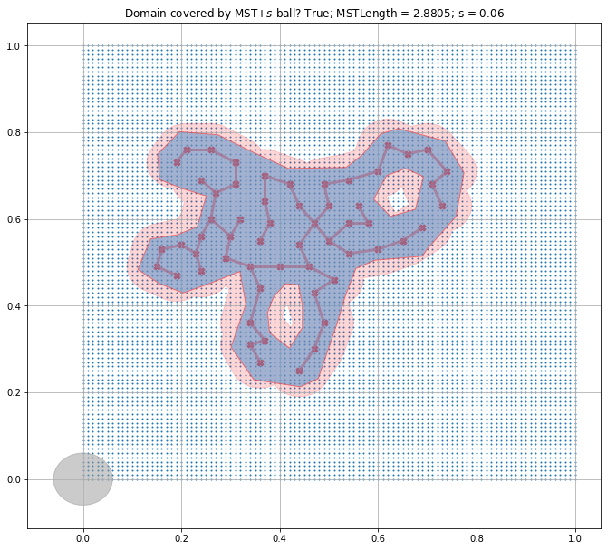

# MDP_MST

## The Maximum Distance Problem (MDP) using Minimum Spanning Trees (MSTs)

### Computational exploration (See [arXiv paper](https://arxiv.org/abs/2004.07323) for details)

Given a compact set *E* in n-dimensional real space (\R^n) and a radius s > 0, the maximum distance problem (MDP) asks to find a compact and connected subset of \R^n of smallest one dimensional Hausdorff measure, whose s-neighborhood covers *E*. For sets *E* in 2D, we prove that minimizing over minimal spanning trees (MSTs) that connect the centers of balls of radius s, which cover *E*, solves the MDP. 

Here you can computationally explore instances of MDP, and try to solve them by forming MSTs. You select the domain *E* in 2D  (in the unit square, to be precise), which is supposed to be a closed, bounded set with possible disjoint holes. You then select vertices for the MST. For a given choice of s, the coverage of *E* by the set (MST + s-ball) is verified and displayed. You can then change s, and/or pick a different set of vertices for the MST.

### Required packages

* [Shapely](https://pypi.org/project/Shapely/)
* [Descartes](https://pypi.org/project/descartes/)
* [Figures](https://pypi.org/project/Figures/)
* matplotlib
* numpy
* scipy (for [distance computations](https://docs.scipy.org/doc/scipy/reference/spatial.distance.html))

*With regards to Shapely, make sure you save the file **figures.py** (included in this repo) in the current working directory. See  [this web page](Toblerity/Shapely/issues/536) for details of this error.*

#### A Jupyter notebook (MDP_MST.ipynb) as well as a standalone Python program (MDP_MST.py) are provided. Instructions specific to running the Python code are provided in the file Instructions_MDP_MST_py.txt.

### Steps

#### Step 0: Create canvas of unit square, with grid

#### Step 1: Select domain to be covered 

Click anywhere (using the mouse) inside the grid once to initialize, and then click the **sequence** of points that form the boundary of the domain &part;*E*. The sequence could be clockwise (CW) or counterclockwise (CCW). A left click selects a point, a right click cancels the previous selection. Press *Enter* when done. The boundary is set as the collection of edges connecting consecutive points in the sequence (with the last point connecting to the first point).

Errors could result if the boundary loops on itself (i.e., crosses itself at a point). Either cancel selections of points going back to remove the loop, and re-select the boundary points. Or, rerun this Step.

nHoles  **disjoint** holes could be carved out from inside the domain selected as above. Each hole is selected in the same way as selecting \boundary *E*. The order of points could be CW or CCW, and could be different from the order chosen for selecting points of \boundary *E*. You could reassign nHoles to a different number (>= 0) to change the number of holes. One could also choose a hole *outside* the domain *E* to void the inclusion of the hole, but it is better to set the nHoles variable correctly.

#### Step 2: Select vertices for MST

The vertices are chosen from among the grid points, with points clicked by the user rounded to nearest grid points. Start by clicking anywhere inside the domain to initialize, and then select points by left clicks on the mouse. Right click cancels previous selection. Press *Enter* when done.

#### Step 3: MST Computation

We construct the undirected graph G = (V_G, E_G) with cost C_G(E_G), and 
apply Kruskal's algorithm for MST that uses path optimality conditions.

*(Somewhat) naive implementation of Union-Find*  
Using an n_G x n_G matrix (n_G=|V_G|) to manipulate the connected components.

#### Step 4: Display Result MST + s-Ball over Domain

#### Instuctions to continue the computation are presented in both the Jupyter notebook (MDP_MST.ipynb) and in the file Instructions_MDP_MST_py.txt.
